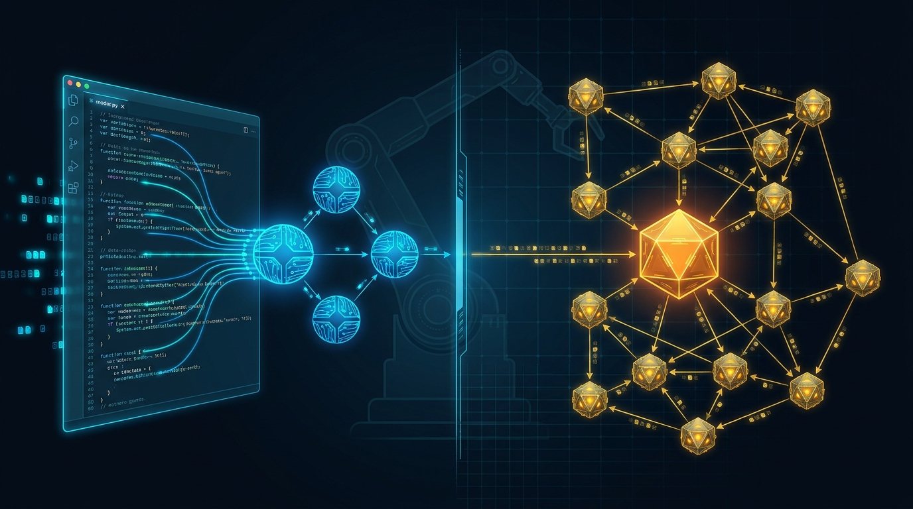

> **5分で読める** · AIシステムアーキテクトが毎日厳選
> *注力分野: Agentic Workflow · AIコーディングツール · 具身AI（Embodied Intelligence）*

---

## 1. Cursor 3.0が「Agents Window」を解禁 — Git Worktree横断でAIエージェント並列実行

**【技術コア】**
Cursor 3.0（2026年4月）は従来のComposerを廃止し、**Agents Window**を導入。フルスクリーンのワークスペースで、ローカル環境・分離Git worktree・SSHリモート・クラウドインスタンスのすべてに対して複数のAIエージェントを並列実行できる。主要新機能：`/worktree` コマンドによるブランチ分離型タスクサンドボックス、ブラウザ上でのUI直接注釈によるDesign Mode、`/best-of-n` による複数モデル盲検比較、JetBrainsプラグイン対応。

**【なぜ注目すべきか】**
AI IDEがエージェントをチャットサイドバーの「おまけ」から、ワークスペースの第一級オブジェクトとして扱うようになった。分離Git worktree上でエージェントを並列実行できることは、AI支援チーム開発の最大の障壁だった「コンテキスト競合」問題を解決する。

🔗 https://www.shareuhack.com/zh-TW/posts/cursor-vs-claude-code-vs-windsurf-2026

---

## 2. Claude Code Opus 4.7 — SWE-bench Verified 87.6% に到達

**【技術コア】**
Anthropicの2026年4月アップデートにより、Claude Codeに搭載されるOpus 4.7は **SWE-bench Verified 87.6%**（従来80.8%から上昇）、SWE-bench Pro 64.3%を記録。1Mトークン・コンテキスト・ウィンドウ、UIスクリーンショット解像度を1.15MPから3.75MPに向上、`xhigh` エフォート層の新設、Task Budgetsによるトークン予算上限設定、`/ultrareview` による深層コードレビュー・レポート生成。

**【なぜ注目すべきか】**
87.6%は単なる一寸アップではない。これにより自律コード・エージェントが、これまで人間のアーキテクトが必要だった「複数ファイル・複数レポジトリにまたがるリファクタリング」タスクを実質的に処理できる閾値を越えた。

🔗 https://vibecoding.app/blog/cursor-vs-windsurf

---

## 3. Windsurf 2.0 + Devin Cloud — ノートPCの電源を切っても続く永続エージェント

**【技術コア】**
Windsurf 2.0（2026年4月）は **Devin Cloudワンクリック・オフロード**を導入：Windsurf IDE上でタスク計画を立案し、実行をDevinのクラウド環境にディスパッチすれば、ローカル端末の電源が切れてもエージェントが継続実行する。Agent Command Centerはカンバン式ダッシュボードで全実行エージェントの状態を管理；Spacesはエージェント・セッション・PR・コンテキストをタスク単位にパッケージ化。

**【なぜ注目すべきか】**
ローカルIDEとクラウド・エージェントの二分法は崩壊した。大規模リファクタリングなど「長時間タスク」において、ローカル端末を起動し続ける必要なくクラウド・エージェントに投げられる体験は、本質的なワークフロー解放である。$20/月でDevin級の自律性を利用できることは重大な参入障壁低下である。

🔗 https://zeeklog.com/2026-aibian-cheng-gong-ju-agentshi-dai-zhong-ji-heng-ping-cursor-vs-claude-code-vs-windsurf-vs-copilot-6

---

## 4. LangGraph + MCP + A2A — 本格運用へ：標準化された生産用マルチエージェント・スタック

**【技術コア】**
2026年4月のfreeCodeCampガイドが、成熟した生産用スタックを体系化：ステートフルなエージェント調整に **LangGraph**、ツール標準アクセスに **MCP**（現在はLinux Foundation管理）、クロスフレームワーク調整に **A2Aプロトコル**（Google主導、150+団体）。参照実装「Learning Accelerator」（4専用エージェント）により、ツール・コーリング・ループ、デュアル温度LLM使用、human-in-the-loop `interrupt()` パターンが実証されている。

**【なぜ注目すべきか】**
エージェント・フレームワーク戦争は、プロトコル標準化の段階に移行しつつある。ツールにはMCP、エージェント間通信にはA2A、調整にはLangGraph — これらは「エージェント時代のTCP/IP」になりつつある。

🔗 https://www.freecodecamp.org/news/how-to-build-a-multi-agent-ai-system-with-langgraph-mcp-and-a2a-full-book

---

## 5. Gemini 3.5 Flash登場：フロンティア級の4倍速、Google Search AI Modeの新既定モデル

**【技術コア】**
Google I/O 2026（5月19日）で **Gemini 3.5 Flash** が発表され、GeminiアプリとGoogle Search AI Modeの既定モデルとなった。他フロンティア・モデル比で約4倍の生成速度、主要ベンチマークでGemini 3.1 Proを上回る性能。併せて **Gemini Spark**（24/7クラウド常駐型個人AIエージェント）、**GPT-Realtime-2**（128Kコンテキスト・リアルタイム音声エージェント）も発表。

**【なぜ注目すべきか】**
速度は能力である。フロンティア級の品質を維持しながら4倍の生成速度を実現したことは、音声駆動コーディングやリアルタイム・エージェント・チェーンなど、これまで待ち時間がボトルネックだった対話型エージェントの実用化を可能にする。

🔗 https://github.com/Zijian-Ni/awesome-ai-agents-2026

---

## 6. 実世界へ：SAE World Congress 2026 白書 + ROS-LLMフレームワーク（Nature掲載）

**【技術コア】**
今月収束する2つのシグナル：(1) arXiv:2605.10653 — SAE 2026「Embodied AI in Action」パネルの白書。(2) Nature Machine Intelligenceがオープンソース **ROS-LLMフレームワーク** を発表：自然言語指示の原子動作への自動分解、インライン・コード生成とビヘイビア・ツリーの両実行モード、模倣学習による新スキル獲得。コード：http://github.com/huawei-noah/HEBO/tree/master/ROSLLM

**【なぜ注目すべきか】**
Embodied AIは「クールなデモ」段階を抜け、「ガバナンス・フレームワークはどこにある？」段階に入った。2026年はEmbodied AIが「研究プロトタイプ」ではなく「ライフサイクル安全ケースを備えたエンジニアード・システム」として出荷され始める年である。

🔗 https://arxiv.org/abs/2605.10653
🔗 https://www.nature.com/articles/s42256-026-01186-z

---

## 7. 2026 AIエージェント・ランドスケープ：400+ ツール、30コミット、3言語

**【技術コア】**
`awesome-ai-agents-2026` レポジトリ（2026年5月更新）は400以上のエージェント・フレームワーク・モデル・プロトコルを追跡。今月の注目：OpenClaw v2026.5.12、Mastra（21K+ stars）、Dify（55K+ stars）、OpenAI Agents SDK（2026年4月メジャー・アップデート）。

**【なぜ注目すべきか】**
2026年半ばにエージェント・フレームワークを評価するなら、エコシステムは2つの陣営に分岐している。MCP/A2Aを第一級市民として扱う「プロトコル・ネイティブ」陣営か、後付けで対応している「レガシー」陣営か。この区別が今後12カ月のプロトコル標準化の波を生き残れるかを決定する。

🔗 https://github.com/Zijian-Ni/awesome-ai-agents-2026
