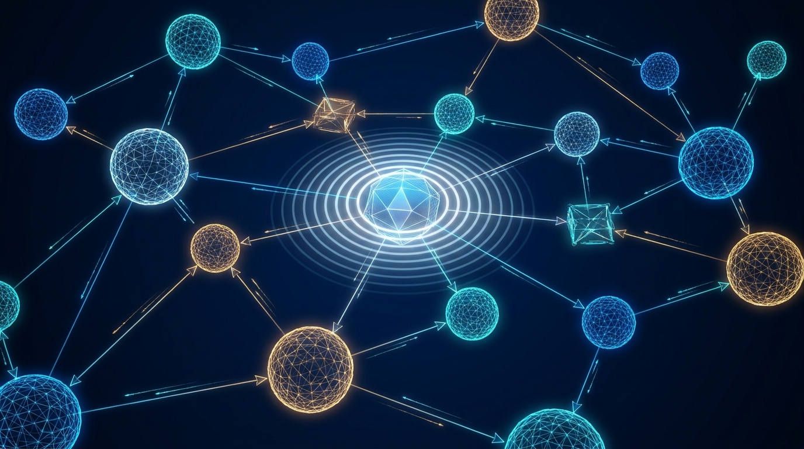

> **5分で読める** · AIシステムアーキテクトが毎日厳選
> *注力分野: Agentic Workflow · AIコーディングツール · 具身AI（Embodied Intelligence）*

---

## 1. Google I/O 2026: Gemini 3.5 Flash・Spark・Omni 世界モデル

**【技術コア】**
Google は I/O 2026 でエージェント機能に全振りした。**Gemini 3.5 Flash** は競合フロンティアモデル比で 4 倍の出力速度を実現しつつ、コストは半分以下。企業が 1 日 1 兆トークン処理する場合、ワークロードの 80% を 3.5 Flash に移行すれば年間 10 億ドル以上の削減が可能としている。**Gemini Spark** は 24/7 稼働する個人向けクラウドエージェント。Gmail・Docs・Sheets などの Google 製品全体と接続し、近日中にサードパーティ MCP ツールもサポート予定。「思考トレース」をリアルタイムで表示し、ユーザーはいつでも操作を中断可能。**Gemini Omni** は物理環境をシミュレートする世界モデル。任意のモダリティ（テキスト・画像・音声・動画）の入出力に対応し、動画生成・編集を Gemini アプリ、Google Flow、YouTube Shorts で提供。すべての生成物には SynthID 透かしが自動埋め込まれる。

**【なぜ注目すべきか】**
Google にとって最も攻めたエージェント戦略。4 倍速 + 50% コスト削減の組み合わせは、OpenAI や Anthropic の API 価格に対する深刻な脅威。Spark の「思考トレース」透明性は、個人向けエージェントの新しい安全基準を打ち立てる。Omni によって Google は Sora/Runway と直接競合しつつ、身体性 AI 応用に必要な「物理世界シミュレーション」という欠落ピースを埋めることになる。

🔗 https://www.cnbc.com/2026/05/19/google-ai-ultra-gemini-spark-omni.html

---

## 2. Cognition AI が Windsurf を 2.5 憶ドルで買収 — SWE-1.5・Codemaps・内蔵 Devin

**【技術コア】**
Cognition AI（自動自律ソフトウェアエンジニア「Devin」の開発元）が 2025 年 12 月に Windsurf を約 2.5 憶ドルで買収、統合は 2026 年 Q1-Q2 に完了した。統合後のスタックには 3 つの画期的機能が含まれる：(1) **SWE-1.5** — Windsurf の高速コンテキスト検索システムと共同設計された独自コーディングモデル。エージェントコーディングベンチマークにおいて Claude Sonnet 4.5 比で 13 倍高速をうたう；(2) **Codemaps** — AI が注釈を付与したコードベースの視覚的グラフ。モジュール間の関係性、レイヤー間のデータフロー、関数の呼び出し箇所を可視化；(3) **内蔵 Devin** — メインストリーム IDE として初めて、完全自律型の長時間稼働エージェントをエディタ内で直接実行。Windsurf Pro は月額 15 ドルと、Cursor Pro（20 ドル）より 5 ドル安い。

**【なぜ注目すべきか】**
これはエージェント層における垂直統合そのもの：1 社ですべて（モデル = SWE-1.5、検索 = Fast Context、IDE = Windsurf、自律エージェント = Devin）を保有する。Cursor、Claude Code、GitHub Copilot は少なくとも 1 つの層をサードパーティに依存している。Codemaps は 2026 年 5 月時点で Cursor にも Claude Code にも存在しない真正の差別化要因。

🔗 https://www.nxcode.io/resources/news/cognition-windsurf-acquisition-swe-1-5-codemaps-2026

---

## 3. LangGraph + MCP + A2A：2026 年のマルチエージェント・プロトコル・スタックが安定化

**【技術コア】**
2026 年、実運用マルチエージェントシステムのための 3 層プロトコル・スタックが結晶化した：**MCP（Model Context Protocol）** はサーバーからエージェントへのツール・リソース公開を管理；**A2A（Agent-to-Agent）** は Google が Cloud Next '25 でオープンソース化し、現在 50 社以上の技術パートナーが参画、フレームワークを跨いだエージェント間の発見・機能交渉・タスク調整を処理；**LangGraph** はチェックポイント、人間介入（human-in-the-loop）、状態永続化を伴うオーケストレーション・ランタイムを提供。`langchain-mcp-adapters` ライブラリ（2025 年 12 月公開）により、MCP サーバーを LangGraph グラフに接続することが自明になった。A2A 仕様は Apache ライセンスでフレームワーク非依存。CrewAI、AutoGen/AG2、OpenAI Agents SDK はすべて 2026.x リリースで A2A 互換性を追加予定。

**【なぜ注目すべきか】**
半年前、マルチエージェントシステムは「糊で貼り付けたようなコードのジャングル」だった。今日、明確で相互運用可能な標準がある：ツールには MCP、エージェント調整には A2A、実行には LangGraph（または同等物）。これにより、異なるフレームワーク上に構築されたエージェント同士（例：LangGraph 監督者が CrewAI 調査サブエージェントと OpenAI Agents SDK コーディングサブエージェントを調整）が、カスタムアダプターなしで A2A 経由で協調できる。企業にとって、これは「科学プロジェクト」と「出荷可能なシステム」の違いである。

🔗 https://qubittool.com/zh/blog/mcp-a2a-a2ui-protocol-stack-guide

---

## 4. Probing Embodied LLMs：高い観測忠実度が問題解決を妨げる場合（ArXiv 2605.20072）

**【技術コア】**
ベルリン工科大学ロボティクス・生物学研究所による ArXiv 最新論文（2605.20072、2 日前公開）。高忠実度観測（例：テキストのみのシーン記述 vs. RGB-D + 深度）が、身体性 LLM エージェントの性能向上に寄与するかを体系的に検証。驚くべき発見：**高い観測忠実度はタスク成功率を低下させる場合がある**。論文は 2 つの異なる失敗モード——(1) 知覚エラー（豊富なセンサーデータを誤って解釈する）、(2) 推論エラー（正しい知覚でさえも計画に失敗する）——を特定し、これらは明確には分離できないことを示した。「Lockbox」評価を用いて、著者らは LLM エージェントが高忠実度入力下で反復行動ループに陥ることを実証した。これは、センサーデータを増やせば自動的に良くなるという前提自体が、身体性推論能力の対応する進歩なしには成立しないことを示唆している。

**【なぜ注目すべきか】**
この論文は、身体性 AI における広まった前提——「より多くのセンサーデータ = より良いエージェント」——を突く。現在の LLM はセンサー・フュージョンに対応準備ができておらず、豊富な観測を適切に推論できない場合、実際には性能が悪化する可能性があることを示唆している。ロボティクス・チームが LLM を操作・航法スタックに統合する際、これは重要な設計シグナルである：観測パイプラインは、モデルの推論能力と共同最適化される必要があり、センサー帯域幅を最大化するだけでは不十分である。

🔗 https://arxiv.org/abs/2605.20072

---

## 5. Antigravity 2.0：Google のマルチエージェント・オーケストレーターがデスクトップに到達

**【技術コア】**
Antigravity は I/O 2026 でコーディング・アシスタントから完全なマルチエージェント・オーケストレーション・プラットフォームへと進化した。**Antigravity デスクトップアプリ** が新しいハブとなる：競合うエージェントを並列タスクで同時オーケストレーション（例：エージェント A が Web サイト・コードを作成、エージェント B がブランド・アセットを生成、エージェント C が製品アーキテクチャを計画）し、競合を回避。**Antigravity CLI** はターミナル中心の開発者にこれを提供。**Antigravity SDK** は Google の内部エージェント・ハーネス（Google の自社製品を駆動する同じシステム）を外部開発者に公開、Gemini モデル向けに最適化。内部テストでは：93 の同時エージェントが複雑なプロジェクトを完了し、2.6B トークンを消費、OS を完全に機能する状態でゼロから構築し、API コストは 1,000 ドル未満だった。また **CodeMender**（高度な推論を用いて重要な脆弱性を自動検出・パッチするセキュリティ・エージェント）も出荷された。

**【なぜ注目すべきか】**
Antigravity 2.0 は、Claude Code と Codex に対する Google の回答。差別化要因は、競合解決を伴う同時マルチエージェント・オーケストレーション——Claude Code も Codex もネイティブには処理できないもの——である。SDK の公開は重要：サードパーティ開発者が Google の自社製品を駆動する同じエージェント・ランタイムを使用できるようになる。CodeMender がうたい通りに動作するなら、オープンソース・コードベースにおける OWASP Top 10 脆弱性に有意に影響を与える可能性がある。

🔗 https://news.qq.com/rain/a/20260520A01A1I00

---

## 6. awesome-ai-agents-2026：決定的な 350+ ツール・エコシステム・マップ

**【技術コア】**
`Zijian-Ni/awesome-ai-agents-2026` GitHub リポジトリは、2026 年エージェント・エコシステムの最も包括的な厳選リストとして浮上した——基盤モデル、エージェント・フレームワーク（LangGraph、CrewAI、AG2、OpenAI Agents SDK、Pydantic AI）、プロトコル層（MCP、A2A）、ツール・エコシステム、実運用デプロイメント・パターンをカバー。13 カテゴリに 350+ プロジェクトを整理し、活発にメンテナンスされている（先週内に更新）。リポジトリはベンチマーク結果（SWE-bench、GDPval、AgentBench）と、20+ 次元にわたるモデル能力マトリックスも追跡している。

**【なぜ注目すべきか】**
2026 年にエージェント関連の何かを構築する場合、このリポジトリが地図となる。エコシステムは 2025 年初頭の約 50 の注目プロジェクトから、今日の 350+ へと成長した——そしてこの分類は実際に有用である（単なる star 農業リストではない）。ベンチマーク追跡を含めることは、これを正当なリファレンスにし、単なるスター・ファーミング・リポジトリではないことを示している。アーキテクトがフレームワーク選択を評価する場合、これは 4〜6 時間の散発的な調査を節約する。

🔗 https://github.com/Zijian-Ni/awesome-ai-agents-2026

---

## 7. Gemini Omni：Google の世界モデルが物理シミュレーションを開発者に提供

**【技術コア】**
**Gemini Omni** は Google DeepMind の世界モデルで、I/O 2026 で発表され段階的に公開される。物理環境をシミュレートし、エージェントの行動に基づいて次状態の結果を予測する——ロボティクスとゲーム・シミュレーションにおける DeepMind の長年の研究に基づいて訓練されている。入門層である **Omni Flash** は画像と音声の入出力をサポートし、Gemini アプリ、Google Flow、YouTube Shorts で利用可能。主な機能：(1) 自然言語を用いた既存映像内の行動・キャラクター・オブジェクト変更による動画編集；(2) 物理的一貫性を持つリアリスティックな画像生成；(3) 任意対任意モダリティ・サポート。すべての出力には SynthID 透かしが含まれる。上位層（より高い物理シミュレーション忠実度）は 2026 年後半に公開予定。

**【なぜ注目すべきか】**
世界モデルは、LLM 推論と現実世界ロボティクスの間の「欠落した層」である。Omni は、実ハードウェアで行動を実行する前に物理的結果をシミュレートする方法を開発者に提供する——身体性 AI 開発の大規模な加速となる。YouTube Shorts への統合はまた、数ヶ月以内に数十億のユーザーが世界モデル生成コンテンツと対話することを意味する。ロボティクス・コミュニティにとって、これは実用グレード API を持つ初の広くアクセス可能な世界モデルである。

🔗 https://deepmind.google/blog/
