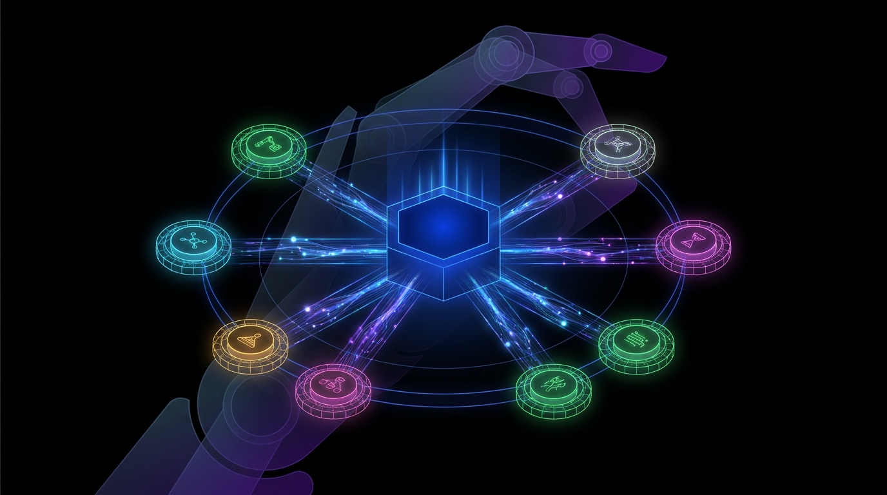

> **5分で読める** · AIシステムアーキテクトが毎日厳選
> *注力分野: Agentic Workflow · AIコーディングツール · 具身AI（Embodied Intelligence）*

---

## 1. Claude Code Agent View：全セッションを1つのダッシュボードで管理

**【技術コア】**
Anthropicは2026年5月11日、Claude Code向けに**Agent View**をリリースした。単一のCLI画面から複数の並列Claude Codeセッションを起動・監視・操作できる統合ダッシュボードだ。各サブエージェントのスポーンと同時にgit worktreeが自動作成され、`/goal`コマンドで目標を注入できる。スーパーバイザーアーキテクチャを採用しており、プライマリセッションがサブセッションをツールとして呼び出すオーケストレーションが可能となった。

**【なぜ注目すべきか】**
これまで複数エージェントを並列実行するには、別々のターミナルウィンドウを手動で管理する必要があった。Agent Viewはその摩擦を解消：1つのリスト画面、全セッションのライブステータス、コンテキストスイッチなしのインライン返信。スーパーバイザーがサブエージェントをツール呼び出しとして扱うパターンは、チームが待ち望んでいたプロダクションレベルのマルチエージェント設計だ。これはAgentICな開発ワークフローがターミナルに標準化された瞬間である。

🔗 [Claude Code Agent View ドキュメント](https://code.claude.com/docs/en/agent-view)

---

## 2. Microsoft MDASH：マルチモデル型Agenticサイバー防衛がベンチマークを制覇

**【技術コア】**
Microsoftの自律コードセキュリティチームは2026年5月12日、**MDASH**（Multi-model Dynamic Agentic Scanning Harness）を発表した。コードパターン認識・脆弱性推論・エクスプロイト検証の各専門モデルを協調展開する構成で、CyberGymベンチマークにて**88.45%**を達成し、AnthropicとOpenAI両社の単一モデルシステムを上回った。MDASHにより、Windowsのネットワーキングと暗号化コンポーネントから16件の未知の脆弱性が新たに発見された。

**【なぜ注目すべきか】**
フロンティア単一モデルを両者ともに超えたことが公式に文書化された、初めてのAgenticセキュリティシステムだ。複数の専門モデルをオーケストレーターが協調させる「分業型Agentic設計」は、セキュリティ以外のあらゆるドメインにも転用可能。自律的な脆弱性発見がスケールして実現可能になったことを、セキュリティチームに明確に示している。

🔗 [Microsoft Security Blog](https://www.microsoft.com/en-us/security/blog/2026/05/12/defense-at-ai-speed-microsofts-new-multi-model-agentic-security-system-tops-leading-industry-benchmark/)

---

## 3. LangGraph v1.1.3：分散ランタイム + 深層Agentテンプレート群

**【技術コア】**
LangGraph v1.1.3の目玉は2点：(1) **分散ランタイム** — 複数実行ノードへのエージェントデプロイが可能になり、手動シャーディング不要で自動的な状態同期による水平スケーリングを実現；(2) **深層Agentテンプレート** — スーパーバイザー-ワーカー、階層的プランナー、リフレクションループなどのプロダクション実績パターンをキュレーションしたライブラリで、LangGraph StudioビジュアライゼーションフックとLangSmithトレース統合付きで提供。

**【なぜ注目すべきか】**
「ローカルでは動く」から「スケールしてプロダクションで動く」へのギャップを埋めるアップデートだ。これまでチームはLangGraph上に独自のパーティショニング・状態同期レイヤーを構築する必要があった。v1.1.3により、水平スケーラビリティは設定オプションになり、カスタムエンジニアリング案件ではなくなった。テンプレートライブラリと組み合わせることで、新チームはアーキテクチャ試行錯誤フェーズをスキップし、実績パターンのチューニングに直接入れる。

🔗 [Agentic Frameworks 完全ガイド 2026](https://softmaxdata.com/blog/definitive-guide-to-agentic-frameworks-in-2026-langgraph-crewai-ag2-openai-and-more/)

---

## 4. Pelican-Unified 1.0：初の真の統合具身基盤モデル

**【技術コア】**
研究者はArXiv（2605.15153）にて**Pelican-Unified 1.0**を発表した。厳格な**統合原則**に基づき訓練された初の具身基盤モデルで、単一のVLMが理解・推論・想像（世界モデリング）・行動生成の4機能をタスク固有ヘッドなしで処理する。全4つの認知モードを共有トークン空間にマッピングし、行動出力はテキストトークンと同じ方式でデコードされ、知覚モデルと制御モデルを隔ててきたモダリティ境界を排除した。

**【なぜ注目すべきか】**
「1モデル、4機能」の設計は、今日のパイプライン型ロボティクススタック（知覚・計画・制御の独立モジュール構成）からのパラダイムシフトだ。統合化はデプロイ複雑性を削減し、ファインチューニング時のエンドツーエンド勾配フローを可能にする。最も重要なのは、ロボットが行動前に想像モジュール（世界モデル）を使って結果をシミュレートできる点だ。このアプローチがスケールすれば、具身AIにとってのトランスフォーマーになりうる。

🔗 [ArXiv 2605.15153](https://arxiv.org/abs/2605.15153)

---

## 5. AIコーディングエージェント2026年対決：7強、用途別に勝者が異なる

**【技術コア】**
LushBinaryの2026年5月ベンチマーク比較では、7つの主要AIコーディングエージェントを評価：Claude Code、Google Antigravity、OpenAI Codex Desktop（v0.130.0・GitHub Stars 83,200+）、Cursor（最大8並列エージェントワークツリー）、Kiro（AWS仕様駆動型IDE）、GitHub Copilot、Windsurf。SWE-bench VerifiedではClaude Codeが約80.8%でトップ；KiroはPRD→コード自動生成のスペック駆動開発で差別化。

**【なぜ注目すべきか】**
AIコーディングツール空間は、明確に異なる*哲学*を持つ製品に分化した — ターミナルエージェント（Claude Code）、スペックファーストIDE（Kiro）、並列ワークツリー（Cursor）、クラウド永続エージェント（Windsurf/Devin）。1つのツールが全用途で勝つことはない。探索的作業をする個人開発者にはClaude Codeのベンチマークスコアが重要。ドキュメント化されたスペックを先行する企業チームにはKiroのワークフローが防衛力が高い。各ツールの哲学の理解が、ベンチマーク数字の暗記より重要になっている。

🔗 [AIコーディングエージェント比較 2026](https://lushbinary.com/blog/ai-coding-agents-comparison-cursor-windsurf-claude-copilot-kiro-2026/)

---

## 6. AGIBOT GO-2：論理推論から精密実行への「ラストマイル」を橋渡しする基盤モデル

**【技術コア】**
AGIBOTがGO-2をリリース。高レベルの論理計画を精密で巧みな物理操作に変換する「ラストマイル」を埋めるために特別に設計された次世代具身AI基盤モデルだ。デュアルストリームアーキテクチャで意味的意図処理とモーター制御合成を分離し、クロスアテンション融合レイヤーを通じて推論時に統合する。200万件以上の人間遠隔操作マニピュレーションデータセットで訓練。

**【なぜ注目すべきか】**
ラストマイル — ロボットが「理解していること」を「実際に実行する」こと — は、研究デモと工場デプロイを隔てるボトルネックだった。推論と実行を明示的に分離してレイト融合するGO-2のアーキテクチャ設計は、この課題への原理的アプローチだ。人型ロボットの商業展開が加速する中（Tesla Optimus、Figure 03）、推論-行動を確実に橋渡しする基盤モデルが成功プラットフォームを決定する。

🔗 [The Robot Report](https://www.therobotreport.com/agibot-releases-go-2-foundation-model-embodied-ai/)
