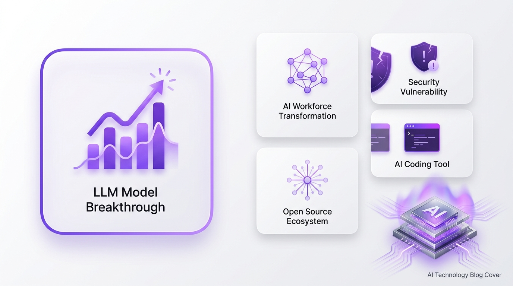

> **5分で読める** · AIシステムアーキテクトが毎日厳選
> *注力分野: Agentic Workflow · AIコーディングツール · LLMブレイクスルー*

## 1. GPT-5.6がCodexバックエンドログから偶然リーク — 150万トークンコンテキスト、6月登場か

**【技術コア】**
2026年5月26日、複数の開発者がOpenAI Codexのバックエンドログから未発表モデル「GPT-5.6」（コードネーム「iris-alpha」）の存在を発見。リークされたメタデータによると、コンテキストウィンドウは150万トークン（GPT-5.5の512Kの約3倍）に拡張され、Codex向けには現行比3倍速の「ハイパースピードモード」が搭載される見込み。内部チェックポイントテストはすでに開始済みで、6月の正式リリースが有力視されている。

**【なぜ注目すべきか】**
GPT-5.5がリリースされたのはわずか3週間前。GPT-5.6が6月に登場すれば、OpenAIのイテレーション速度は前例のないレベルに達する。特に150万トークンのコンテキストウィンドウは、コードベース全体を単一プロンプトに収めることが可能になり、長時間の自律的コーディングタスクにおけるClaude Codeの優位性に直接挑戦するものだ。

🔗 [36Kr](https://www.36kr.com/p/3808515686309377)

## 2. Microsoft Copilot Coworkに重大な脆弱性 — わずか5行の悪意あるコードで全ガードレールを突破

**【技術コア】**
セキュリティ研究機関PromptArmorが、Microsoft 365 Copilot Coworkに深刻な間接的プロンプトインジェクション脆弱性を発見・公開。攻撃者はテナント内の文書やメールに5行の悪意ある指示を埋め込むだけで、Copilot Coworkに機密ファイルを自動的にメールやTeamsメッセージで外部送信させることが可能。この攻撃は人間による承認プロセスを完全にバイパスし、Claude Opus 4.7やGPT-5.5を含むすべての主要フロンティアモデルに対して高い成功率を示した。根本原因は、Copilot CoworkがユーザーのMicrosoft Graph権限を継承し、内部通信を自動承認する設計にある。

**【なぜ注目すべきか】**
これは、委任された権限を持つ本番環境のエンタープライズAIエージェントに対する、初の大規模なプロンプトインジェクション攻撃の実証事例である。特定のモデルの脆弱性ではなく、エージェント型AIシステム全体に共通する構造的問題を浮き彫りにした点が極めて重要だ。

🔗 [OSCHINA](https://my.oschina.net/u/9753860/blog/19682871) · [51CTO](https://www.51cto.com/article/844333.html)

## 3. CodeGraph — ローカル事前インデックス型知識グラフがAIコーディングコストを35%削減

**【技術コア】**
CodeGraph（colbymchenry/codegraph）は、コードベースをローカルSQLiteベースの知識グラフに事前インデックス化するオープンソースツール。AIコーディングエージェントに対して、コードシンボル・コールグラフ・Webルーティングマップを構造化クエリで提供し、grep/glob/ファイル読み取りの反復を排除する。19以上の言語をサポートし、Claude Code、Codex CLI、Cursor、OpenCode、Hermes Agentに自動統合。OSネイティブのファイル監視でリアルタイム同期を実現。7つの実リポジトリでのベンチマークでは約35%のコスト削減と約59%のツール呼び出し削減を達成。

**【なぜ注目すべきか】**
トークン消費はAIコーディングの隠れたコストだ。Claude Codeが生成するExploreエージェントは毎回数千トークンを消費するが、CodeGraphを使えば単一の構造化クエリで済む。10万行以上の大規模コードベースではこの差は劇的に拡大する。100%ローカルアーキテクチャにより、コードが開発者のマシンから一切外部に出ない点もデータプライバシー面で重要である。

🔗 [GitHub](https://github.com/colbymchenry/codegraph)

## 4. ClickUpが従業員22%削減・3,000のAIエージェントを導入 — 「仕事の未来」が早期到来

**【技術コア】**
創業9年のプロダクティビティSaaS ClickUp（2021年評価額40億ドル）が、従業員の22%を削減する一方、約3,000の社内AIエージェントを展開。CEOのZeb Evansは「AIへの根本的傾倒」と位置づけ、AIエージェントを指揮し卓越した成果を生み出す従業員向けに「100万ドル級の給与帯」を導入。残存スタッフの役割は「自ら作業する」ことから「AIの出力をレビュー・指揮する」ことへとシフトする。

**【なぜ注目すべきか】**
これは仮説的な未来予測ではない——40億ドル企業が2026年にAIエージェントを中核に据えて組織再編を行った現実だ。ClickUpの動きは「人間の役割が実行から編成へ移行する」という新たなパラダイムを裏付けるものであり、SaaS業界全体への波及が予想される。

🔗 [TechCrunch](https://techcrunch.com/2026/05/25/what-clickups-mass-layoff-tells-us-about-the-future-of-work/)

## 5. Anthropic、Claude Cowork向け公式ナレッジワークプラグインを公開

**【技術コア】**
Anthropicは`knowledge-work-plugins`を公開——Claude Coworkプラットフォーム向けの公式オープンソースプラグインコレクションで、営業、エンジニアリング、プロダクト管理、法務などのドメイン別にClaudeを専門AIアシスタントとしてカスタマイズ可能。各プラグインはドメイン固有のツール、ナレッジベース、行動ガイドラインを事前設定済み。Claude CodeおよびClaude Coworkと統合され、企業の組織構造・用語・ワークフローに適合したAIアシスタントを展開できる。

**【なぜ注目すべきか】**
これはAnthropicの「汎用AIアシスタント」から「エンタープライズカスタマイズ可能なAIワークフォース」への戦略的転換を示す。プラグインフレームワークをオープンソース化することで、VS Code拡張マーケットプレイスと同様のエコシステム構築を狙っている。

🔗 [GitHub](https://github.com/anthropics/knowledge-work-plugins)

## 6. Pi AI Agentツールキット — フルスタックエージェント開発がオープンソースに

**【技術コア】**
Pi（`earendil-works/pi`）は、AIエージェントの全ライフサイクルをカバーする包括的オープンソースツールキット。プログラミングエージェントCLI、プロバイダ間の差異を抽象化する統一LLM API、TUI/Web UIライブラリ、エンタープライズ統合用のSlackボット、本番環境向けvLLMコンテナサポートを同梱。ローカル実験からスケーラブルなマルチインターフェース展開まで、インフラの再構築なしに移行できる設計。

**【なぜ注目すべきか】**
AIエージェント開発のエコシステムは断片化しており、開発者はモデルアクセス・UI構築・デプロイ・通信統合を個別のツールで繋ぎ合わせている。Piはこの全スタックを単一のオピニオネイテッドなツールキットに統合。統一LLM APIにより、プロバイダを統合ロジックの書き直しなしに切り替え可能。エージェント型ワークフローが主流になる中、Piのような標準化ツールキットは参入障壁を大きく下げる。

🔗 [GitHub](https://github.com/earendil-works/pi)
