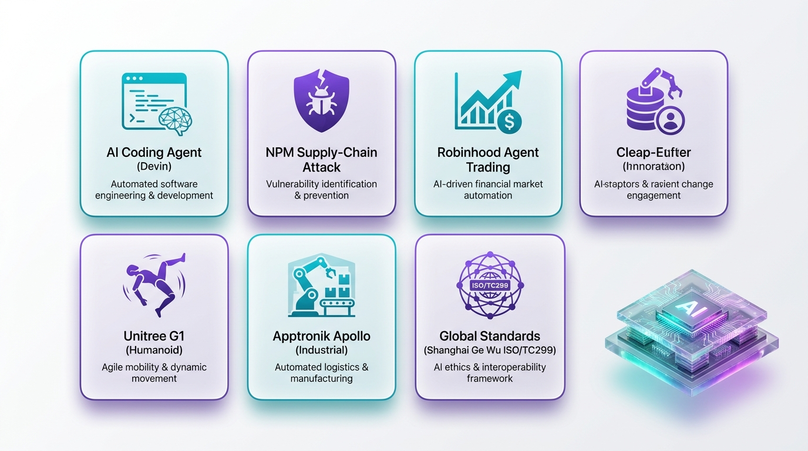

> **5分で読める** · AIシステムアーキテクトが毎日厳選
> *注力分野: Agentic Workflow · AIコーディングツール · 具身AI（Embodied Intelligence）*

---

## 1. Cognition AIが$1B調達、評価額$26B — Devinが9ヶ月で2.5倍に

**【技術コア】**
自律型AIソフトウェアエンジニア「Devin」を開発するCognition AIは、10億ドル超の資金調達を実施。プレマネー評価額250億ドル（ポストマネー260億ドル）は、2025年9月の約100億ドルから2.5倍の急成長。Claude CodeやCodexがAIコーディングの話題を独占する中、この大型調達はAIコーディングエージェント市場が「二強」ではないことを示している。

**【なぜ注目すべきか】**
創業3年のAIコーディングスタートアップが260億ドルという評価額は前例がない。自律型ソフトウェアエンジニアリングエージェントが「機能」ではなく「プラットフォーム」と見なされている証拠だ。ターミナルプラグインやIDE拡張ではなく、独立したAIエンジニアとしてのDevinの道は、ソフトウェア開発の未来に対する根本的に異なる賭けである。

🔗 [TechCrunch](https://techcrunch.com/2026/05/27/ai-coding-startup-cognition-raises-1b-at-25b-pre-money-valuation/) · [The Decoder](https://the-decoder.com/ai-coding-agent-devin-maker-cognition-more-than-doubles-its-valuation-to-26-billion-in-under-nine-months/)

---

## 2. 初のnpmサプライチェーン攻撃がClaude AIツール環境を標的に

**【技術コア】**
「mouse5212-super-formatter」という悪意あるnpmパッケージが、Claude Codeの専用アップロードディレクトリからファイルを窃取し、攻撃者が管理するGitHubリポジトリへ流出させていたことが発覚。汎用開発マシンではなく、AIコーディングツール環境を特に標的とした初の文書化されたサプライチェーン攻撃である。

**【なぜ注目すべきか】**
AIコーディングツールが開発ワークフローに不可欠になるにつれ、それらは高価値の攻撃対象領域となる。Claude Codeは会話履歴、プロジェクトコンテキスト、環境変数、場合によってはAPIキーをローカルディレクトリに保存する。この攻撃は、脅威アクターが現在AIツールチェーンを特に標的にしていることを示している。

🔗 [AI Weekly](https://aiweekly.co/alerts/npm-malware-exfiltrates-claude-ai-files-to-github) · [BitNewsBot](https://bitnewsbot.com/new-npm-malware-steals-claude-ai-user/)

---

## 3. Robinhood、MCP経由でAIエージェントによる株式自動取引を開始

**【技術コア】**
Robinhoodはエージェント型取引機能を開始。ユーザーはAnthropicのClaudeやOpenAIのChatGPTなどのAIエージェントを、MCP標準経由で専用投資口座に接続できる。エージェントはガードレール付きのサブ口座で自律的に株式取引を実行可能。さらに、3%キャッシュバック付きのAIエージェント専用クレジットカードも導入。FINRA承認済み。

**【なぜ注目すべきか】**
これはエージェント型コマースの画期的な瞬間だ。AIエージェントは情報検索からアクション実行へと進化してきたが、金融取引は信託委任の新たなレベルを示す。MCPが統合標準として使用されていることも注目に値する。「AIエージェントクレジットカード」という概念は、エージェントが投資だけでなく家計支出も管理する未来を示唆している。

🔗 [TechCrunch](https://techcrunch.com/2026/05/27/robinhood-now-lets-your-ai-agents-trade-stocks/) · [The Decoder](https://the-decoder.com/robinhood-lets-ai-agents-trade-shares-and-make-credit-card-purchases-for-customers/)

---

## 4. Unitree G1が予約10万台突破、$16,000 — ヒューマノイドが大衆市場へ

**【技術コア】**
中国のロボティクス企業Unitreeは、人型ロボットG1の予約注文が10万台を突破したと発表。価格は16,000ドルで、ホンダ・シビックより安い。同社はまたG1が側転を成功させる動画を公開し、急速に進歩する動的モーション制御を披露。Unitreeは昨年、人型ロボットの出荷台数で世界一位を記録した。

**【なぜ注目すべきか】**
16,000ドルで10万台の予約注文は、人型ロボットが研究室の珍品から消費者製品へと移行しつつあることを示している。これは人型ロボットにとってのテスラ・モデル3の瞬間だ。今月初めに実証された音声コマンド機能と組み合わせることで、G1は汎用プラットフォームになりつつある。

🔗 [Robot News Today](https://robotnewstoday.com/) · [Beijing Post](https://beijingpost.com/shanghai-unveils-embodied-ai-platform-and-pursues-global-standards-for-humanoid-robots)

---

## 5. ApptronikがGoogle Venturesから$350M調達 — MercedesがApollo倉庫展開を拡大

**【技術コア】**
オースティン拠点のApptronikは、Google Venturesがリードする3億5,000万ドルのシリーズBラウンドを完了。同時に、Mercedes-BenzはApollo人型ロボットの展開をパイロットプログラムから本格的な倉庫・製造オペレーションへと拡大することを発表。ApolloロボットはMercedes施設でマテリアルハンドリング、キッティング、組立ラインサポート作業を遂行している。

**【なぜ注目すべきか】**
これはUnitreeの消費者向けプッシュに対する産業向けの対応策だ。Apptronik + Mercedesは、実際の製造環境における人型ロボットの最も具体的な事例の一つであり、デモではなく生産ラインでの作業である。Google Venturesのリード投資は、人型ロボティクスのサプライチェーンがR&Dを超えて成熟しつつあるというビッグテックの確信を示している。

🔗 [Robot News Today](https://robotnewstoday.com/) · [Figure News](https://www.figure.ai/news)

---

## 6. 上海「格物」具身AIプラットフォーム発表 — 単一コードベースで100種類以上のロボットを訓練

**【技術コア】**
上海の国家・地方共建人型ロボティクスイノベーションセンターは、具身AIシミュレーションプラットフォーム「格物（Ge Wu）」を発表。普遍的な強化学習フレームワークを用いて、単一のコードベースからロボットモデルごとの追加プログラミングなしで100種類以上のロボットを訓練できる。上海はまた、ISO/TC299の下に人型ロボット小委員会を設立し、国際標準の策定を推進。現在100台以上を訓練中で、2027年までに1,000台への拡大を目指している。

**【なぜ注目すべきか】**
「単一コードベースで100種類以上のロボット」という主張が核心的なブレークスルーだ。検証されれば、具身AIの最も困難な問題の一つ — ロボット形態ごとに別々の訓練パイプラインを必要とするsim-to-real転送ギャップ — を解決する。ISO/TC299標準化の推進も同様に戦略的であり、中国は5Gで行ったように、人型ロボットの国際規制枠組みを早期に形成しようとしている。

🔗 [Beijing Post](https://beijingpost.com/shanghai-unveils-embodied-ai-platform-and-pursues-global-standards-for-humanoid-robots)
