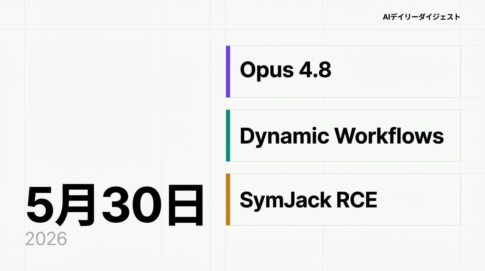

> **5分で読める** · AIシステムアーキテクトが毎日厳選
> *注力分野: Agentic Workflow · AIコーディングツール · 具身AI（Embodied Intelligence）*

---

## 1. Anthropicが評価額9650億ドルに到達 — 世界最大のAIスタートアップへ

**【技術コア】**
Anthropicは5月28日、Altimeter Capital、Dragoneer、Greenoaks、Sequoia Capitalが主導する650億ドルのシリーズHラウンドを完了し、評価額が9650億ドルに到達。2026年2月の3800億ドルから約3倍に跳ね上がり、OpenAI（2026年3月時点で8520億ドル）を抜いて世界最大の非公開AI企業となった。売上実行率は470億ドルに達し、主な牽引役はClaude Codeの採用拡大。

**【なぜ注目すべきか】**
同日、AnthropicはOpus 4.8をリリースし、Claude Code向けのDynamic Workflowsを発表した。資金調達から製品投入までのフライホイールが加速している。SpaceXAI、OpenAI、Anthropicの3大AIラボがIPO準備を進める中、今後6ヶ月で公開市場のAI勢力図が決まる。

🔗 [CNBC: Anthropic tops OpenAI as most valuable AI startup](https://www.cnbc.com/2026/05/28/anthropic-open-ai-startup-value.html)

---

## 2. Claude Opus 4.8 + Dynamic Workflows — 数百の並列サブエージェントを実現

**【技術コア】**
5月28日に発表されたOpus 4.8は、コードの欠陥を見逃す確率が約4分の1に減少、ツール呼び出しの効率が大幅に改善。最大の新機能はDynamic Workflows（Claude Code Enterprise/Team/Maxでリサーチプレビュー）。数百の並列サブエージェントを調整し、コードベース規模の移行を既存のテストスイートを品質ゲートとして実行する。Messages APIはタスク途中でのシステムメッセージ更新に対応。

**【なぜ注目すべきか】**
Claude Codeを「AIプログラマー」から「AIエンジニアリングチーム」へと進化させる機能。Opus 4.7から4.8への41日間という異例の短いリリースサイクルは、CodexやGemini Flashからの競争圧力への応答を示している。

🔗 [Anthropic: Introducing Claude Opus 4.8](https://www.anthropic.com/news/claude-opus-4-8)

---

## 3. SymJack: 6大AIコーディングエージェントにRCE脆弱性

**【技術コア】**
Adversa AIがSymJackを公開 — シンボリックリンクハイジャックによるRCE攻撃で、Claude Code、Gemini CLI/Antigravity、Cursor Agent CLI、GitHub Copilot CLI、Grok Build CLI、OpenAI Codex CLIの6製品に影響。細工されたリポジトリがエージェントを騙し、自身の設定ファイルを上書きさせる。承認プロンプトは一つの宛先を表示するが、カーネルはシンボリックリンクを辿って別のターゲットに書き込む。

**【なぜ注目すべきか】**
単一製品のバグではなく、カテゴリ全体に及ぶ設計上の欠陥。CI/CDへの被害範囲は壊滅的で、デプロイキー、署名マテリアル、クラウド認証情報が1つの悪意あるPRで流出する可能性がある。

🔗 [Adversa AI: SymJack](https://adversa.ai/blog/the-approval-prompt-is-lying-to-you-symlink-rce-in-five-ai-coding-agents-claude-code-cursor-antigravity-copilot-grok-build/)

---

## 4. DeepSeek V4-Proが75%恒久値下げ — コストパフォーマンス世界一に

**【技術コア】**
DeepSeekはV4-Pro APIの75%割引を5月31日以降も恒久化。入力価格は100万トークンあたり0.435ドルに固定され、GPT-5.5の約34分の1のコスト。同時に社内で「Harness」チームを結成し、コードエージェントの開発に着手。

**【なぜ注目すべきか】**
古典的なインフラ戦略：限界費用で価格設定しボリュームを獲得、垂直統合でアプリケーションへ進出。恒久価格への固定は企業導入の不確実性を解消する。

🔗 [Sina Finance: DeepSeek V4-Pro永久降价75%](https://finance.sina.com.cn/roll/2026-05-25/doc-inhzawmn3616830.shtml)

---

## 5. Andrej Karpathy、Anthropicの事前学習チームに電撃加入

**【技術コア】**
OpenAI共同創業者Andrej KarpathyがAnthropicの事前学習チームに加入。「Karpathy Loop」手法 — AIエージェントが自律的に700回の実験を実行、小規模モデルで学習時間を11%短縮 — を持ち込む。

**【なぜ注目すべきか】**
フロンティアAI研究者にとってAnthropicが目的地であることを強化する人材獲得のクーデター。Opus 4.8とDynamic Workflowsとの組み合わせで、モデル自身の改善ループに参加できるモデルの構築に向かっている。

🔗 [36Kr: Karpathy正式加入Anthropic](https://www.36kr.com/p/3816814284145798)

---

## 6. Codex Thursday: Appshots + Goal Mode GA + Remote Mac

**【技術コア】**
Codex v0.133.0（5月22日）はMac Appshots — アプリケーションウィンドウをキャプチャしエージェントが「見る」ことを可能に — を搭載。Goal Mode（/goal）が一般提供開始。Remote Mac機能も追加。

**【なぜ注目すべきか】**
Appshotsはテキスト出力しか読めないAIエージェントの知覚ギャップを埋める。Goal Mode GAはCodexが「これ一つやって」から「この成果を所有しろ」への移行を示す。

🔗 [CSDN: Codex Appshots & Goal Mode](https://blog.csdn.net/weixin_45888077/article/details/161492808)

---

## 7. Alibaba Qwen 3.7-Max: エージェント時代のMCPネイティブ旗艦モデル

**【技術コア】**
AlibabaのQwenチームは5月20日、Qwen 3.7-Maxをリリース。100万トークンコンテキスト、SWE-Pro 87.6%、入力価格100万トークンあたり2.50ドル。MCPネイティブサポートとAnthropic Messages API互換性を備える。

**【なぜ注目すべきか】**
MCPネイティブサポートとMessages API互換性を搭載した初の主要な非米国モデル。Opus 4.8の半額で、コスト重視のエージェントデプロイメントの現実的な選択肢。

🔗 [Qwen 3.7-Max公式発表](https://www.aihub.cn/ai-model/qwen3-7-max/)
