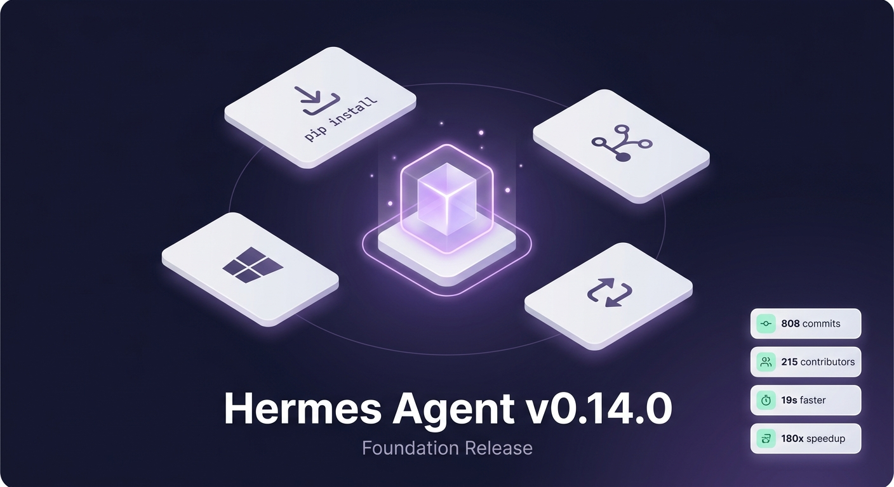

## はじめに

2026年5月16日、Hermes Agent v0.14.0（The Foundation Release）が公開された。808コミット、633のマージ済みPR、215名のコントリビューター、545件のIssueクローズ（うちP0が12件、P1が50件）——数字だけ見ても、このリリースの規模は異例だ。

だが本質は別のところにある。v0.14.0は派手な新機能ではなく、**日常的に遭遇する摩擦を徹底的に削減する**ことに集中したリリースだ。

## 対象読者

- Hermes Agentの導入を検討している開発者
- すでに使っているが、運用の細かいストレスを感じているユーザー
- Claude Proなどのサブスクリプションを複数ツールで活用したい方

## この記事を読むメリット

- v0.14.0の主要な変更点を5分で把握できる
- 実際の開発ワークフローにどう影響するかが理解できる
- アップグレードすべきかどうかの判断材料が得られる

## 結論

v0.14.0は「毎日使うからこそ気になる問題」を片付けたリリースである。インストールの手間、ツール間の互換性、セッション管理、起動速度——これらの積み重ねが開発体験を損なっていたが、今回の更新で大きく改善された。**「動く」から「気持ちよく使える」への転換点**と言っていい。

## インストール：PyPI対応とWindowsネイティブ化

これまでHermes Agentのセットアップは「GitHubからクローン → シェルスクリプト実行 → 環境変数設定 → エラー対応」という流れで、順調にいっても30分はかかっていた。

v0.14.0では**PyPIパッケージ**として配布されるようになった：

```bash
pip install hermes-agent
```

WheelにはInk TUIとシェルランチャーが同梱されており、Gitもインストールスクリプトも不要。Slack、Matrix、Feishu、DingTalkなどのアダプターや画像生成、音声TTSといった重い依存関係は**遅延ロード**に変更され、初回使用時までインストールされない。ベースインストールのフットプリントは大幅に縮小した。

さらに**Windowsネイティブ対応**（early beta）も実現。WSLなしでcmd.exeとPowerShellから直接実行できる。PowerShellインストーラーはMinGitの自動セットアップ、Microsoft Store版Pythonのスタブ検出、Ctrl+Cシグナルの適切な処理までカバーする。40件以上のWindows専用修正が含まれている。

## hermes proxy：サブスクリプションの壁を取り払う

Claude Proの能力は高いが、APIがOpenAI互換ではない——この制約は多くの開発者を悩ませてきた。VS CodeのContinue拡張、Codex CLI、Aider、Clineなどのツールは、OAuth認証のClaude Proをそのままでは利用できない。

`hermes proxy`はこの問題を解決する。OAuth認証されたサブスクリプションを、OpenAI互換のローカルエンドポイントとして公開する：

```bash
hermes proxy --provider anthropic --port 8080
```

あとは各ツールで `OPENAI_BASE_URL=http://localhost:8080/v1` を設定するだけだ。Claude Pro、ChatGPT Pro、SuperGrokのすべてに対応する。1つのサブスクリプションで、あらゆるOpenAI互換ツールが使えるようになる。

## /handoff：会話を止めずに役割を切り替える

Hermesのペルソナシステムには1つの大きな弱点があった。コーディングアシスタントからライティングアシスタントに切り替えるには、会話を終了し、新しいセッションを開始する必要があった。メッセージ履歴もツール呼び出し履歴も、すべて失われる。

`/handoff`はこの制約を撤廃する：

```
/handoff copywriter
```

会話の全コンテキスト（メッセージ、ツール呼び出し、メモリ）を保持したまま、モデル・ペルソナ・プロファイルを切り替えられる。実用的なユースケースとしては、高速で安価なモデルで下準備を進め、複雑な課題に直面した時点で推論特化モデルに引き継ぐ——というワークフローが、1つの会話の中で完結する。

## パフォーマンス：数字で見る改善

| 指標 | v0.13 | v0.14 |
|------|-------|-------|
| コールドスタート | ベースライン | 約19秒短縮 |
| `hermes tools` 全プラットフォームチェック | ~14秒 | 1.5秒未満 |
| ブラウザツール実行速度 | 1x | 約180倍 |

コールドスタートの改善は、遅延インポート・モデルカタログのディスクキャッシュ優先・並列ヘルスチェックの組み合わせによる。ブラウザツールの高速化は、Chrome DevTools ProtocolのWebSocket接続を永続化し、呼び出しごとのセッション生成を排除した成果だ。

特筆すべきは**Claudeクロスセッションプロンプトキャッシュ**。Anthropic、OpenRouter、Nous Portal経由のClaudeモデル利用時に、システムプロンプト・スキル・メモリプレフィックスが1時間キャッシュされる。`/new`で新規セッションを開いてもキャッシュが再利用されるため、レイテンシとコストの両面で恩恵がある。ヘビーユーザーにとって、この差分は小さくない。

## その他のアップデート

- **x_search**：X/Twitter検索が組み込みの第一級ツールに。OAuthまたはAPIキー認証、追加スキル不要
- **LSPセマンティック診断**：ファイル書き込み後に言語サーバーがインクリメンタル診断を実行。型エラー・未定義シンボル・不足インポートを即時検出（v0.13では構文チェックのみ）
- **Grok統合**：SuperGrok OAuthログイン。grok-4.3は1Mトークンのコンテキストウィンドウに対応
- **LINE + SimpleX Chat**：対応メッセージングプラットフォームが22に

## まとめ

v0.14.0が解決した問題は、どれも地味だが確実に開発体験を損ねていたものだ。インストールできるか、他のツールと連携できるか、セッションを止めずに役割を切り替えられるか、起動は速いか——これらは「あったらいいな」ではなく、「ないと困る」の領域に達している。

Hermes Agentはv0.14.0で、実験的なプロジェクトから日用品へと一歩踏み出した。

---

最後までお読みいただきありがとうございました。
