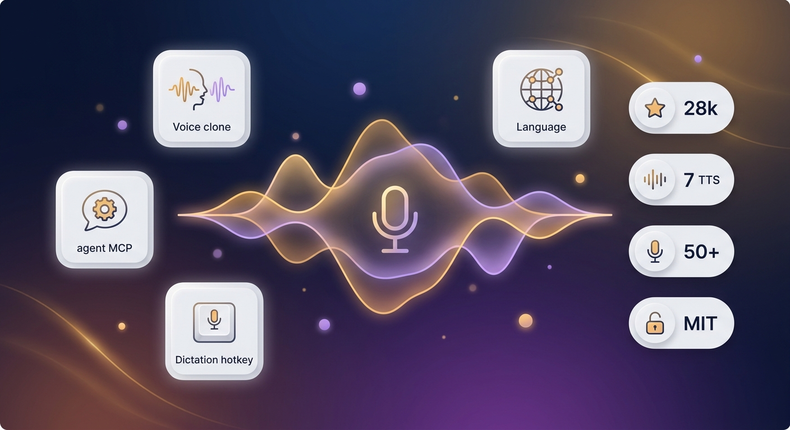

## はじめに

ElevenLabs は音声クローンの分野で確固たる地位を築いている。WisprFlow は音声入力で優れた体験を提供する。しかし、月額数十ドルのコストと音声データのクラウドアップロードは、多くの開発者にとって無視できないハードルだ。

2026年5月、GitHub で **28,500 Star** を獲得した [Voicebox](https://github.com/jamiepine/voicebox) が注目を集めている。MIT ライセンスの完全ローカル AI ボイススタジオであり、ElevenLabs と WisprFlow の両方の機能を統合した設計が特徴だ。

## 対象読者

- 音声合成・音声認識ツールを探している開発者
- AI Agent に音声機能を追加したいエンジニア
- 音声データのプライバシーを重視するユーザー

## この記事を読むメリット

- Voicebox の全機能を 5 分で把握できる
- 7 つの TTS エンジンの使い分けが理解できる
- MCP サーバーを使った Agent 連携の具体的な手順がわかる

## 結論

Voicebox は「音声処理はクラウドで」という前提を覆すプロジェクトである。28.5K Star という数字が示す通り、ローカル音声処理への需要は確実に高まっている。7 つの TTS エンジン、MCP サーバーによる Agent 連携、グローバルホットキー音声入力——これらの機能を完全ローカルで実現し、MIT ライセンスで公開している点が最大の価値だ。

## 音声クローン：数秒で完了

Voicebox の音声クローンは、数秒のリファレンス音声をアップロードするだけでモデルを生成する。23 言語に対応しており、英語、日本語、中国語、アラビア語、ヒンディー語、スワヒリ語などをカバーする。

内蔵する 7 つの TTS エンジンには、明確な使い分けがある：

| エンジン | ユースケース | 特徴 |
|----------|-------------|------|
| **Chatterbox Turbo** | 感情表現が必要な音声 | `[laugh]` `[sigh]` `[gasp]` のタグで笑い声やため息を生成 |
| **Qwen3-TTS** | 多言語クローン | 「ゆっくり」「ささやき声で」といった自然言語指示を解釈 |
| **Kokoro** | CPU 環境 | 82M の超軽量モデル、50 のプリセット音声 |
| **LuxTTS** | 高音質・軽量 | 約 1GB VRAM、48kHz、CPU で 150 倍リアルタイム |
| **TADA** | 長時間音声 | HumeAI モデル、700 秒以上の一貫した音声 |
| **Chatterbox Multilingual** | 全言語カバー | 23 言語すべてに対応 |
| **Qwen CustomVoice** | 手軽な利用 | リファレンス音声不要のプリセット音声 |

50 以上のプリセット音声も内蔵しており、クローンなしですぐに使い始められる。生成後の音声には、Spotify の Pedalboard ライブラリを使った 8 種類のエフェクト（リバーブ、ディレイ、コンプレッサー、ピッチシフト、コーラス、ハイパス/ローパスフィルター）をリアルタイムプレビュー付きで適用できる。

## MCP サーバー：Agent に声を与える

Voicebox の最大の特長は、**MCP（Model Context Protocol）サーバー**の内蔵だ。

Claude Code、Cursor、Cline、Windsurf など、MCP 対応の AI Agent から直接 Voicebox を呼び出せる。Claude Code への接続は 1 コマンド：

```bash
claude mcp add voicebox \
  --transport http \
  --url http://127.0.0.1:17493/mcp \
  --header "X-Voicebox-Client-Id: claude-code"
```

設定後、Agent はクローンした声で「テスト通過、マージ可能」と報告する。Agent ごとに異なる声を割り当てれば、声で役割を識別できる。

さらに **「人格化」** 機能では、各音声に「冷静なエンジニア」「辛口のコードレビュアー」といったペルソナを設定できる。ローカル LLM（Qwen3 0.6B/1.7B/4B）が Agent の発言をペルソナに合わせて書き換え、その後に音声合成を行う。声だけでなく、**話し方そのもの**をカスタマイズできる設計だ。

## 音声入力とハードウェア対応

グローバルホットキーによる音声入力機能も搭載。ホットキーを押しながら話し、離すと現在のテキストフィールドに自動ペーストされる。macOS ではアクセシビリティ API を使用し、クリップボードを汚染しない。音声認識は Whisper ベースで完全ローカル処理。

ハードウェア対応も幅広い：

| プラットフォーム | アクセラレーション |
|-----------------|-------------------|
| Apple Silicon | MLX（Metal、4〜5 倍高速） |
| NVIDIA GPU | CUDA |
| AMD GPU | ROCm |
| Intel Arc | IPEX/XPU |
| CPU のみ | Kokoro 82M で実用的に動作 |

macOS 用 DMG、Windows 用 MSI のインストーラーを提供。初回起動時に必要なモデル重みを自動ダウンロードする。Kokoro は 82MB、Qwen3-TTS は数 GB。REST API と MCP Server は `localhost:17493` で動作し、API ドキュメントは `http://127.0.0.1:17493/docs` で確認できる。

## まとめ

音声 I/O のローカル化は必然だった。音声データは生体情報であり、漏洩リスクはパスワード漏洩に匹敵する。一方で、オープンソースの TTS・STT・LLM は、コンシューマーハードウェアで実用的な品質に到達している。

Voicebox の価値は機能の充実度だけではない。AI Agent は無機質なテキストボックスではなく、声を持ち、感情を表現し、人格を備えた協働パートナーになりうる——その可能性を具体的な形で示した点に本質がある。

[GitHub: jamiepine/voicebox](https://github.com/jamiepine/voicebox)
